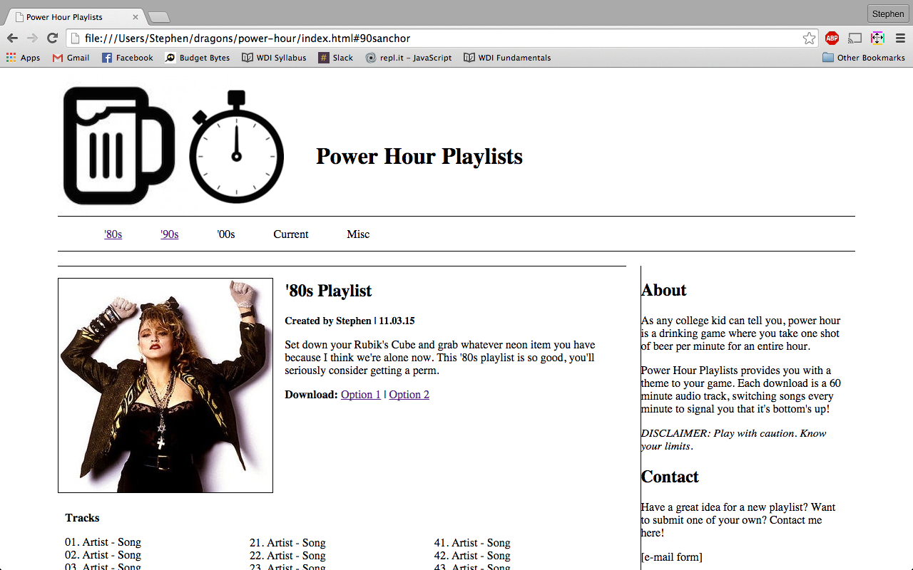
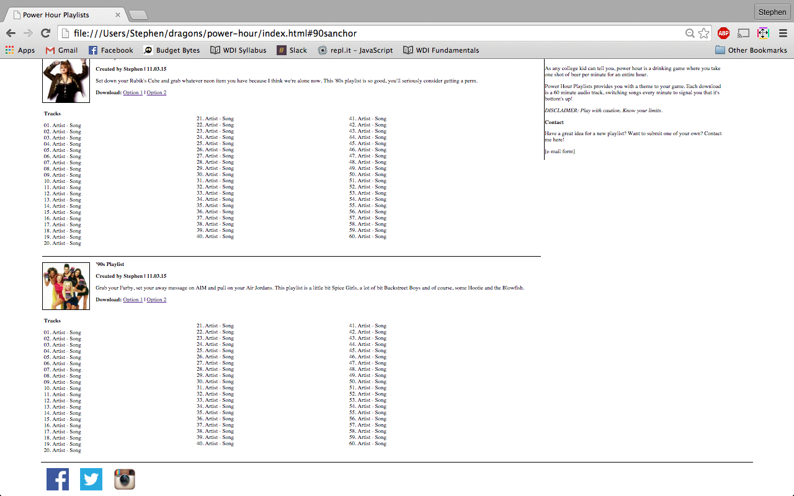

The constructor provides all of the information for the image.

I added in an interactive element, so when you click Madonna, audio plays.

This is more I want to do and play around with, but I neeeeeed to go to sleep. :D

